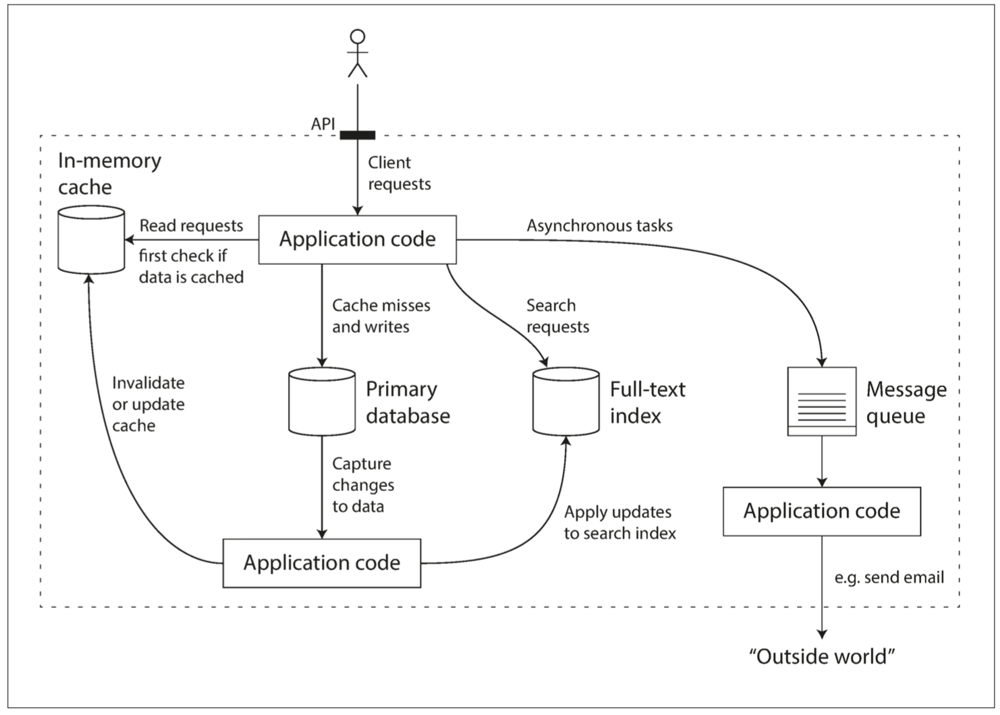
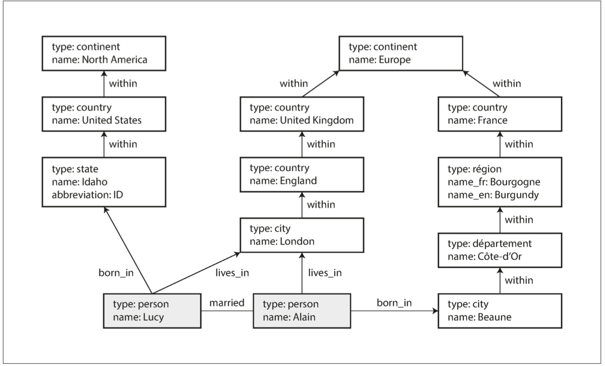

### 数据密集型应用

数据密集型应用通常由标准组件构建而成，标准组件提供了很多通用的功能：

-   存储数据——数据库
-   加快读取速度——缓存
-   允许用户按关键字搜索数据，或以各种方式对数据进行过滤——搜索索引
-   向其他进程发送消息，进行异步处理——流处理
-   定期处理积累的大批量数据——批处理


近些年来，出现了许多新的数据存储工具与数据处理工具，他们针对不同场景进行优化，使得类别之间的界限变得越来越模糊：

-   数据存储可以被当成消息队列用（Redis）
-   消息队列带有类似数据库的持久保证（Apache Kafka）

其次，越来越多的应用程序有着各种严格而广泛地要求，单个工具不足以满足所有的数据处理和存储需求。取而代之的是，总体工作被拆分成一系列能被单个工具高效完成的任务，并通过应用代码将他们封合起来。


如果将缓存和全文搜索功能从数据库剥离出来，那么使缓存/索引与主数据库保持同步通常是应用代码的责任。架构可能是这样子的：




### 数据模型

#### 关系模型与文档模型

关系模型：

-   数据被组织成关系，其中每个关系是元组的无序集合。

文档模型：

-   更好的可扩展性，包括非常大的数据集或者非常高的写入吞吐量
-   更具多动态性和表现力的数据模型

如果应用程序中的数据具有类似文档的结构（一对多关系树，通常一次性加载整个树），那么实用文档模型可能会比较好。将类似文档的结构分解成多个表的关系技术可能导致繁琐的模式和不必要的复杂的应用程序代码。

文档模型有一定的局限性：不能直接饮用文档中的嵌套项目，而是需要说“用户251的位置列表中的第二项”。只要文件嵌套不太深，通常都不是问题。

文档数据库对连接的支持也比较糟糕，需要在应用程序中进行模拟连接，可能会导致应用程序代码更加复杂、性能更差。

#### 文档模型中的架构灵活性

文档数据库有时候称为**无模式**，也就是**读时模式**，数据的结构是隐含的，只有在数据被读取时才被解释。相应的是**写时模型**，即传统的关系型数据库方法中，模式明确，保证所有的数据都符合其模式。

当由于某种原因，集合中的项目并不都具有相同的结构式，读时模式更具优势：

-   存在许多不同类型的对象，将每种类型的对象放在自己的表中是不现实的。
-   数据的结构由外部系统决定。无法控制外部系统且它随时可能变化。

#### 查询的数据局部性

文档通常以单个连续字符串形式进行存储，编码为JSON、XML、BSON等。如果应用程序经常需要访问整个文档，那么存储局部性能带来性能优势。

局部性仅仅适用于同时需要文档绝大部分内容的情况。数据库通常需要加载整个文档，即使只访问其中的一小部分，这对于大型文档来说是很浪费的。更新文档时，通常需要整个重写，只有不改变文档大小的修改才可以容易地原地执行，因此建议保持相对小的文档，并避免增加文档大小的写入。

#### 图数据模型

关系模型可以处理多对多的简单情况，但是随着数据之间的连接变得更加复杂，将数据建模为图形显得更加自然。

一个图由两种对象组成：顶点、边。多种数据可以被建模为一个图形：

***社交图谱***

顶点是人，边指示哪些人彼此认识。

***网络图谱***

顶点是网页，边表示指向其他页面的HTML链接。

***公路或铁路网络***

顶点是交叉路口，边代表它们之间的道路或铁路线。

图提供了一种一致的方式，用来在单个数据存储中存储完全不同类型的对象：



####属性图

在属性图模型中，每个顶点包括：

-   唯一的标识符
-   一组出边
-   一组入边
-   一组属性（键值对）

每条边包括：

-   唯一标识符
-   边的起点/尾部顶点
-   边的终点/头部顶点
-   描述两个顶点之间关系类型的标签
-   一组属性（键值对）

可以将图存储看作是有两个关系表组成：一个存储顶点，另一个存储边，头部和尾部顶点用来存储每一条边。

```sql
CREATE TABLE vertices (
  vertex_id  INTEGER PRIMARY KEY,
  properties JSON
);

CREATE TABLE edges (
  edge_id     INTEGER PRIMARY KEY,
  tail_vertex INTEGER REFERENCES vertices (vertex_id),
  head_vertex INTEGER REFERENCES vertices (vertex_id),
  label       TEXT,
  properties  JSON
);

CREATE INDEX edges_tails ON edges (tail_vertex);
CREATE INDEX edges_heads ON edges (head_vertex);
```

这个模型的一些特点：

-   任何顶点都可以有一条边连接到任何其他顶点。没有模式限制哪种事物可不可以关联。
-   给定任何顶点，可以高效找到它的入边和出边，从而遍历图，即沿着一系列顶点的路径前后移动。
-   通过对不同类型的关系使用不同的标签，可以在一个图中存储几种不同的信息，同时仍然保持一个清晰的数据模型。

