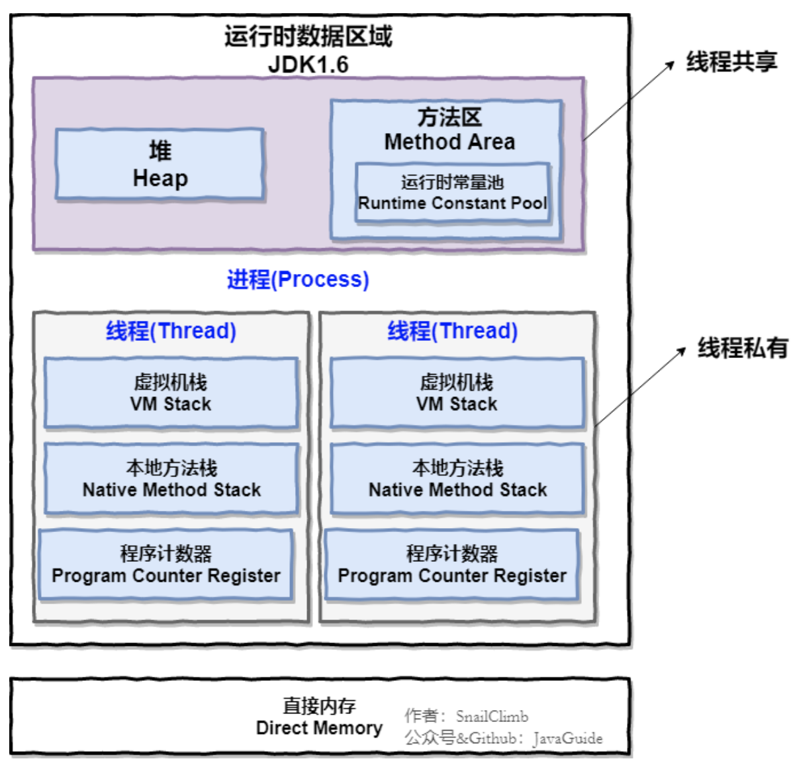
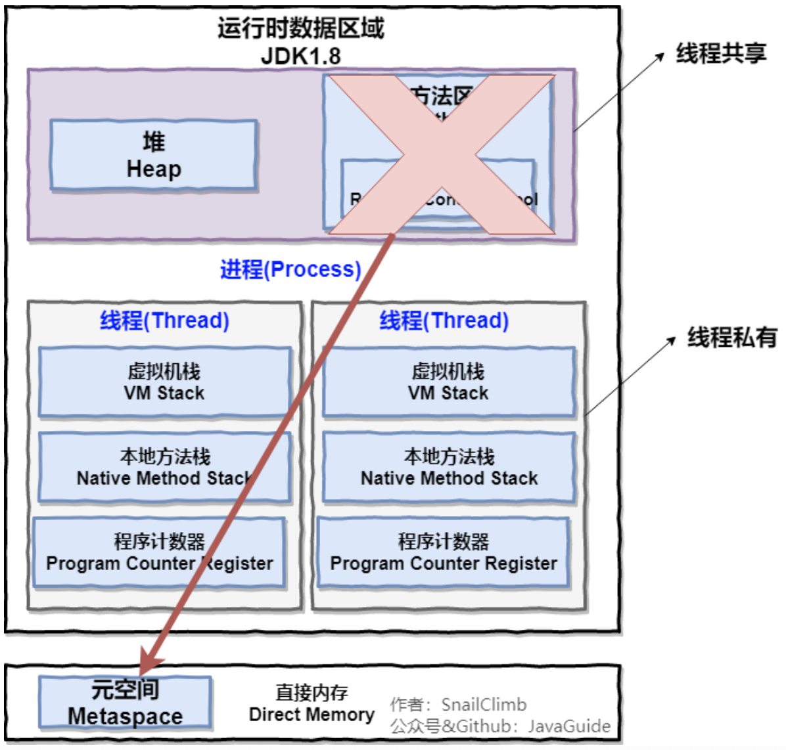
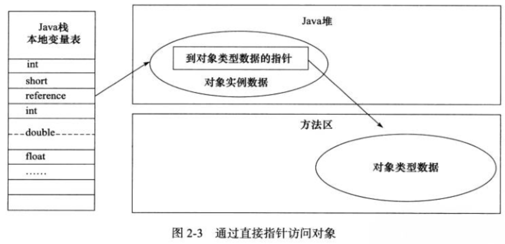

## 运行时数据区

Java虚拟机在执行Java程序的过程中，会把它所管理的内存划分为若干个不同的数据区域。

**JDK1.6：**

**JDK1.8：**

左边绿色部分是线程私有区域，右边蓝色部分是线程共享区域。

#### 程序计数器

程序计数器（线程私有）是一块较小的内存空间，可以看作是当前线程所执行的字节码的行号指示器，如果是Native方法，这个计数器的值为空。字节码解释器工作时就是通过改变这个计数器的值来选取下一条需要执行的字节码指令，诸如分支、循环、跳转、异常处理、线程恢复等基础功能都需要依赖这个计数器来完成。

程序计数器是JVM中唯一一个没有`OutOfMemoryError`情况的区域。

### 虚拟机栈

虚拟机栈（线程私有）的生命周期和线程相同，描述的是Java方法执行的内存模型：每个方法执行的时候都会创建一个栈帧，用于存放局部变量表、操作数栈、动态链接、方法出口等信息。每个方法从调用到完成的过程，就对应着一个栈帧在虚拟机栈中入栈出栈的过程。

虚拟机栈中有两种异常情况：

-   当线程请求的栈深度大于虚拟机所允许的深度，将抛出`StackOverflowError`错误。
-   当虚拟机栈动态扩展过程中无法申请到足够的内存时，就会抛出`OutOfMemoryError`错误。

**局部变量表**

用于存放方法参数和方法内部定义的局部变量，存放了编译器可知的各种基本数据类型、对象引用和returnAddress类型。（指向了一条字节码指令的地址）。局部变量表所需的内存空间在编译期间完成分配，当进入一个方法时，这个方法需要在栈帧中分配多大的局部变量空间是完全确定的，运行期间大小不会改变。

**操作数栈**

操作数栈用弹栈/压栈来访问，是JVM栈中的一个用于计算的临时数据存储区，数据运算的地方大多数指令都在操作数栈弹栈运算，然后结果压栈。

**动态链接**

每个栈帧都包含一个指向运行时常量池中该栈帧所属方法的引用，持有这个引用是为了支持方法调用过程中的动态连接。每一个`class`文件有一个常量池，用以存放它所有的符号引用，字节码中的方法调用指令就是以常量池中指向方法的符号引用作为参数。这些符号引用一部分会在类加载阶段或第一次使用时转化为直接引用，这种转化称为静态解析。另一部分将在每一次运行期间转化为直接引用，这部分称为动态连接。

**方法出口**

当一个方法执行后，只有两种方式退出当前方法：

-   当执行遇到返回指令，会将返回值传递给上层的方法调用者，这种退出的方式称为正常完成出口，一般来说，调用者的PC计数器可以作为返回地址。
-   当执行遇到异常，并且当前方法体内没有得到处理，就会导致方法退出，此时是没有返回值的，称为异常完成出口，返回地址要通过异常处理器表来确定。

当方法返回时，可能进行3个操作：

-   恢复上层方法的局部变量表和操作数栈
-   把返回值压入调用者调用者栈帧的操作数栈
-   调整 PC 计数器的值以指向方法调用指令后面的一条指令

### 本地方法栈

本地方法栈（线程私有）与虚拟机栈之间的不同是，本地方法栈为JVM执行Native方法服务，而虚拟机栈为JVM执行Java方法服务。在HotSpot中，直接将本地方法栈和虚拟机栈合二为一。

与虚拟机栈一样，本地方法栈也会抛出`StackOverflowError`和`OutOfMemoryError`错误。

### 堆

大多数情况下，堆（线程共享）是JVM管理的内存中最大的一块。堆唯一的目的就是存放对象实例，几乎所有的对象实例都在这里分配内存。

堆是GC的主要区域，分为新生代和老年代：

**新生代区域：**

-   Eden空间
-   From Survivor空间（S0）
-   To Survivor空间（S1）

大部分情况，对象都会首先在 Eden 区域分配（大对象直接分配在老年代），在一次新生代垃圾回收后，如果对象还存活，则会进入 s0 或者 s1，并且对象的年龄还会加 1，当它的年龄增加到一定程度（默认为 15 岁），就会被晋升到老年代中。对象晋升到老年代的年龄阈值，可以通过参数 `-XX:MaxTenuringThreshold` 来设置。

通过`-Xms`，`-Xmx`，`-Xss`等参数可以对堆内存大小进行调整：

-   `Xss`规定了每个线程堆栈的大小。
-   `Xms`规定了堆的初始分配大小。
-   `Xmx`规定了堆的最大分配大小。

在堆中没有内存完成实例分配并且无法扩展时，将会抛出`OutOfMemoryError`错误。

### 方法区

方法区（线程共享）用于存储已被虚拟机加载的类信息、常量、静态变量、即时编译器编译后的代码等数据。对这块区域进行垃圾回收的主要目标是对常量池的回收和对类的卸载，但是一般比较难实现。JDK1.7把它当成永久代来进行垃圾回收，但很难确定永久代的大小，因为它受到很多因素影响，并且每次 Full GC 之后永久代的大小都会改变，所以经常会抛出`OutOfMemoryError`异常。为了更容易管理方法区，从 `JDK 1.8` 开始，移除永久代，并把方法区移至元空间，它位于本地内存中，而不是虚拟机内存中。原来永久代的数据被分到了堆和元空间中。元空间存储类的元信息，Class对象、静态变量和字符串常量池等放入堆中。元数据并不是类的Class对象，Class对象是加载的最终产品，静态变量位于 Class对象内，而类的方法代码，变量名，方法名，访问权限，返回值等元数据都是在方法区的。

当方法区无法满足内存分配需求时，将抛出OutOfMemoryError异常。

### 运行时常量池

运行时常量池是方法区的一部分，Class文件中除了有类的版本、字段、方法、接口等描述信息外，还有一项信息是常量池，用于存放在编译器生成的各种字面量和符号引用，这部分内容将在类加载后进入方法区的运行时常量池。除了在编译期生成的常量，还允许动态生成，例如 String 类的 intern()。

### 直接内存

在 JDK 1.4 中新引入了`NIO`类，它可以使用 Native 函数库直接分配堆外内存，然后通过 Java 堆里的 	`DirectByteBuffer` 对象作为这块内存的引用进行操作。这样能在一些场景中显著提高性能，因为避免了在堆内存和堆外内存来回拷贝数据。

## 对象的创建

**类加载检查**

JVM遇到一条`new`指令时，首先去检查这个指令的参数是否能在字符串常量池中定位到一个类的符号引用，并检查这个符号引用代表的类是否已经被加载、解析和初始化过，如果没有则先执行响应的类的加载过程。

**分配内存**

对象所需的大小在类加载完成后便可完全确定，为对象分配空间的任务等同于把一块确定大小的内存从Java堆中划分出来。根据堆内存是否绝对规整，有两种内存分配方式：

-   **指针碰撞（堆内存绝对规整）**：所有用过的内存放在一边，空闲内存放在另一边，中间用一个指针作为分界点带的指示器，分配内存就是把指针向空闲空间挪动一段与对象大小相等的距离。
-   **空闲列表（堆内存不规整）**：JVM维护一个列表，记录那些内存块是可用的，在分配的时候，从列表中找到一块足够大的空间划分给对象实例。

是否规整取决于所使用的的垃圾收集器是否**标记-清除**还是**标记-整理**。

内存分配时可能会有线程安全问题，此时有两种解决方案：

-   对分配内存空间的动作进行同步处理，采用CAS失败重试方式保证更新操作的原子性。
-   每个线程在堆中预分配一小块内存，成为本地线程分配缓冲（TLAB），哪个线程需要分配内存，就在哪个线程的TLAB上分配，只有TLAB用完并分配新TLAB时，才需要同步锁定。

**初始化零值**

这一步保证了对象实例的字段不需要赋值就可以直接使用，程序能访问到这些字段的数据类型对应的零值。

**对象头设置**

设置对象的的一些头部信息，例如这个对象是哪个类的实例、如何找到这个类的元数据信息、对象的HashCode、对象的GC分代年龄等信息。另外，根据虚拟机当前运行状态的不同，如是否启用偏向锁等，会对象头有不同的设置方式。

**执行`<init>`方法**

上面工作都完成之后，从虚拟机的视角来看，一个新的对象已经产生了，但从 Java 程序的视角来看，对象创建才刚开始，`<init>` 方法还没有执行，所有的字段都还为零。所以一般来说，执行 new 指令之后会接着执行 `<init>` 方法，把对象按照程序员的意愿进行初始化，这样一个真正可用的对象才算完全产生出来。

## 对象的内存布局

`Hotspot`虚拟机中，对象在内存中的布局可以分为 3 块区域：**对象头**、**实例数据**和**对齐填充**。

-   对象头包括两部分信息：

    -   用于存储对象自身的运行时数据：如HashCode、GC分代年龄、锁状态标志、线程持有的锁、偏向线程ID、偏向时间戳等。
    -   类型指针：指向它的类元数据的指针，通过这个指针来确定这个对象是那个类的实例。

    如果是数组，还需要一个字段用来记录数组长度。

-   实例数据：对象真正存储的有效信息，即程序中所定义的各种类型的字段内容。

-   对齐填充：并不是必然的，仅仅起占位符的作用，使得对象头部正好是8字节的倍数。

### 对象访问定位

建立对象是为了使用对象，JVM通过栈上的reference数据来操作堆上的具体对象，目前主流的访问方式有使用句柄和直接指针两种。

**使用句柄访问**

Java堆中会划分出来一块内存作为句柄池，reference中存储的就是对象的句柄地址，句柄中包含了对象实例数据与类型数据各自的具体地址信息。使用句柄访问最大的好处就是reference中存储的是稳定的句柄地址，在对象被移动时只会改变句柄中的实例数据指针，而reference本身不需要改变。

**直接使用指针访问**

如果直接使用指针访问，那么堆对象的布局中就必须考虑如何放置访问类型数据的相关信息，而reference中存储的直接就是对象地址。

使用句柄访问最大的好处就是reference中存储的是稳定的句柄地址，在对象被移动时只会改变句柄中的实例数据指针，而reference本身不需要改变。使用直接指针访问最大的好处就是速度快，节省了一次指针定位的时间开销。

