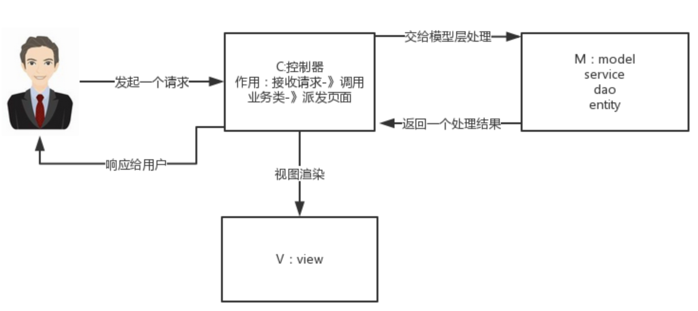
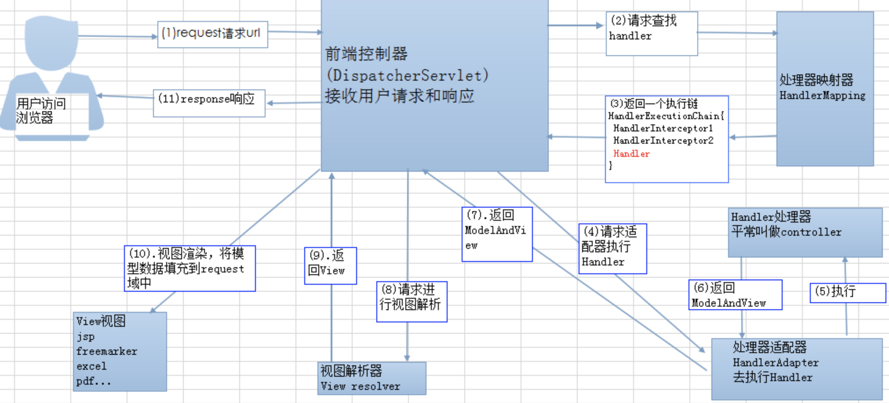

### Servlet

Servlet是一个基于http协议，在Servlet容器中运行的，按照Servlet规范编写的一个Java类。客户端发送请求至服务器端，服务器端将请求发送至Servlet，Servlet生成响应内容并将其传给服务器。

### Servlet的生命周期

1. 创建 Servlet 对象，通过服务器反射机制创建 Servlet 对象，第一次请求时才会创建。
2. 调用 Servlet 对象的 init()方法，初始化 Servlet 的信息，init()方法只会在创建后被调用一次；
3. 响应请求，调用 service()或者是 doGet()，doPost()方法来处理请求，这些方法是运行的在多线程状态下的。
4. 在长时间没有被调用或者是服务器关闭时，会调用 destroy()方法来销毁 Servlet 对象。

**MVC 的原理：**

### SpringMVC 工作原理

SpringMVC 框架是以请求为驱动，围绕 Servlet 设计，将请求发给控制器，然后通过模型对象，分派器来展示请求结果视图。其中核心类是 DispatcherServlet，它是一个 Servlet，顶层是实现的Servlet接口。

**简单来说SpringMVC的流程是这样的：**

客户端发送请求 -> 前端控制器 DispatcherServlet 接受客户端请求 -> 找到处理器映射 HandlerMapping 解析请求对应的 Handler-> HandlerAdapter 会根据 Handler 来调用真正的处理器开处理请求，并处理相应的业务逻辑 -> 处理器返回一个模型视图 ModelAndView -> 视图解析器进行解析 -> 返回一个视图对象->前端控制器 DispatcherServlet 渲染数据（Moder）->将得到视图对象返回给用户

1. 客户端（浏览器）发送请求，直接请求到 `DispatcherServlet`。
2. `DispatcherServlet` 根据请求信息调用 `HandlerMapping`，解析请求对应的 `Handler`。
3. 解析到对应的 `Handler`（ `Controller`）后，开始由 `HandlerAdapter` 适配器处理。
4. `HandlerAdapter` 会根据 `Handler `来调用真正的处理器开处理请求，并处理相应的业务逻辑。
5. 处理器处理完业务后，会返回一个 `ModelAndView` 对象，`Model` 是返回的数据对象，`View` 是个逻辑上的 `View`。
6. `ViewResolver` 会根据逻辑 `View` 查找实际的 `View`。
7. `DispaterServlet` 把返回的 `Model` 传给 `View`（视图渲染）。
8. 把 `View` 返回给请求者（浏览器）

