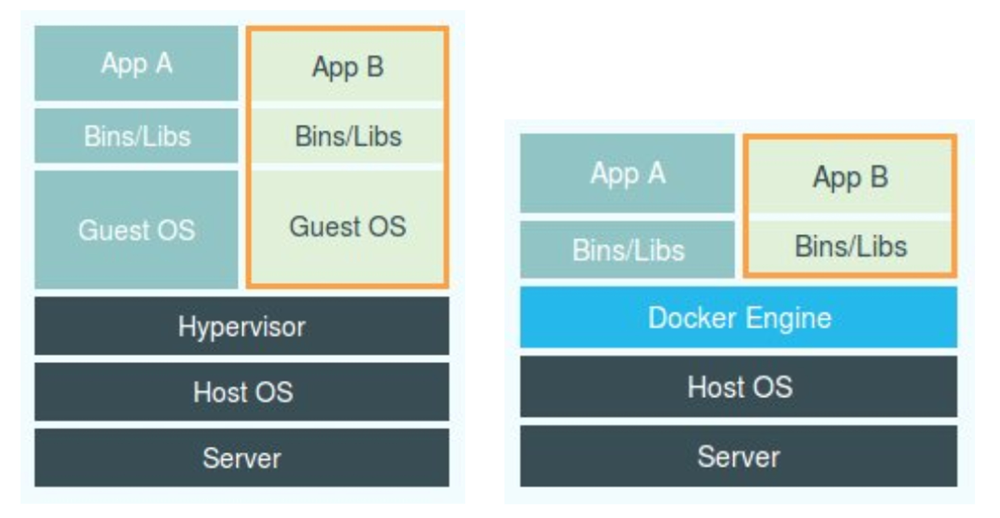

###  容器的概念

容器其实是一种沙盒技术，能够像集装箱一样，把应用“装”起来。这样应用和应用之间就因为有了边界而不会互相干扰，而被装进集装箱的应用也可以很方便的被搬来搬去。

### 容器隔离手段

容器技术的核心功能就是通过约束和修改进程的动态表现，从而为其创造出一个“边界”。对于 Docker 等大多数 Linux 容器来说，`Cgroup` 技术是用来创造约束的主要手段，而 `Namespace` 技术则是用来修改进程视图的主要方法。

>   假设现在在一个 Linux 系统上运行了 Docker项目。
>
>   首先创建一个容器
>
>   ``` shell
>   docker run -it centos:7 /bin/bash
>   ```
>
>   这个命令是启动一个 Docker 容器，`-it` 表示要分配一个文本输入/输出环境，也就是 `tty`，根容器的标准输入相关联，这样就可以和这个 Docker 容器进行交互了，而 `bin/bash` 就是我们要在 Docker 容器里运行的程序。
>
>   此时我们再容器里执行一下 `ps` 指令
>
>   ``` shell
>   PID  USER   TIME COMMAND
>     1 root   0:00 /bin/sh
>     10 root   0:00 ps
>   ```
>
>   可以看到，在这个 Docker 容器里最开始执行的是 `/bin/sh`，这就是容器内部的第1号进程（PID = 1），而容器里一共有两个进程在运行。这就意味着这两个进程已经被 Docker 隔离在了一个跟宿主机完全不同的世界中。

这种其实是 Docker 对被隔离应用的进程空间做了手脚，使得这些进程只能看到重新计算过的进程编号，比如 PID = 1，而实际上在宿主机中，它可能是第 100 号进程。这种技术就是 Linux 中的 Namespace 机制。

Namespace 的使用方式是在 Linux 创建新进程的时候在参数中指定 `CLONE_NEWPID` 参数：

``` c
int pid = clone(main_function, stack_size, CLONE_NEWPID | SIGCHLD, NULL);
```

这时新创建的进程将会“看到”一个全新的进程空间，它的 PID 是1，但在宿主机真实的进程空间里，它的 PID 还是真实数值，比如100。

>   除了 PID Namespace外，Linux 还提供了 Mount、UTS、IPC、Network 和 User 这些 Namespace，用来对各种不同的进程上下文进行隔离操作。
>
>   比如 Mount Namespace，用于让被隔离进程只能看到当前 Namespace 里的挂载点信息；Network Namespace，用于让被隔离进程只能看到当前 Namespace 里的网络设备和配置。

所以容器其实就是一种特殊的进程，在创建进程的时候指定了这个进程所需要启用的一组 Namespace 参数，这样容器就只能“看”到当前 Namespace 所限定的资源、文件、设备、状态或者配置，而对于宿主机以及其他不相关进程，它就完全看不到了。

由于容器就是一个进程，用户的应用进程实际上就是容器里 PID=1 的进程，也是其他后续创建的所有进程的父进程。所以在一个容器中，没法同时运行两个不同的应用，除非能事先找到一个公共的 PID=1 的程序来充当两个不同应用的父进程。

基于 Linux Namespace 的隔离机制最主要的问题就是**隔离的不彻底**。

1.  容器只是运行在宿主机上的一种特殊的进程，所以多个容器之间使用的是同一个宿主机的操作系统内核。
2.  在 Linux 内核中，有很多资源和对象是不能被 Namespace 化的，最典型的就是**时间**。

所以在生产环境中，没有人敢把运行在物理机上的 Linux 容器直接暴露到公网上。

### 容器与虚拟机的区别



上图左边是虚拟机的工作原理。其中 Hypervisor 通过硬件虚拟化技术，模拟出了运行一个操作系统所需要的各种硬件，然后在这些虚拟的硬件上安装了新的操作系统，用户的进程就可以被隔离在这个虚拟的机器中。由于这个虚拟机是真实存在的，就难免带来额外的资源消耗和占用。

上图右边是 Docker 的工作原理，他用 Docker Engine 替换了 Hypervisor，和真实的虚拟机不同，在使用 Docker 时，并没有一个真正的”Docker 容器“运行在宿主机里面，还是原来的应用进程，只不过在创建这些进程时， Docker 为它们加上了各种 Namespace 参数。这也就使得容器额外占用的资源几乎可以忽略不计，这也是它能够在 PaaS 这种更细粒度的资源管理平台上大行其道的重要原因。

### Linux 进程限制

虽然容器内的第 1 号进程只能看到容器里的情况，但在宿主机上，它作为第 100 号进程与其他所有进程之间依然是平等的竞争关系。这就意味着，它所能够使用到的资源是可以随时被宿主机上的其他进程占用的。

**Linux Cgroups** ，全称 **Linux Control Group**，就是 Linux 内核中用来为进程设置资源限制的一个重要功能。它的最主要作用就是限制一个进程组能够使用的资源上线，如 **CPU、内存、硬盘、网络带宽** 等。

**Linux Cgroups，简单的理解就是一个子系统目录加上一组资源限制文件的组合**。

>   对于 Docker 来说，只需要在每个子系统下面，为每个容器创建一个控制组（即创建一个新目录），然后在启动容器进程之后，把这个进程的 PID 填写到对应控制组的 tasks 文件中就可以了。而至于在这些控制组下面的资源文件里填上什么值，就靠用户执行 docker run 时的参数指定了，比如这样一条命令：
>
>   ``` shell
>   docker run -it --cpu-period=100000 --cpu-quota=20000 ubuntu /bin/bash
>   ```
>
>   容器启动后通过查看 Cgroups 文件系统下，CPU 子系统中，“docker”这个控制组里的资源限制文件的内容来确认：
>
>   ``` shell
>   $ cat /sys/fs/cgroup/cpu/docker/5d5c9f67d/cpu.cfs_period_us 100000
>   $ cat /sys/fs/cgroup/cpu/docker/5d5c9f67d/cpu.cfs_quota_us 20000
>   ```
>
>   这意味着这个 Docker 容器，只能使用到 20% 的 CPU 带宽。

### 容器镜像

容器里的进程理应看到一份完全独立的文件系统，这样容器可以再自己的容器目录（如 /tmp）下进行操作，而完全不回收宿主机以及其他容器的影响。

由于 Mount Namespace 修改的是容器进程对文件系统”挂载点“的认知，**这就意味着 Mount Namespace 跟其他 Namespace 的使用略有不同的地方：它对容器进程视图的改变，一定是伴随着挂载操作才能生效。**我们可以在容器进程启动之前重新挂载它的整个根目录“/”。而由于 Mount Namespace 的存在，这个挂载对宿主机不可见，所以容器进程就可以在里面随便折腾了。

为了能够让容器的这个根目录看起来更真实，我们一般会在这个容器的根目录下挂载一个完整操作系统的文件系统，比如 Ubuntu16.04 的 ISO。这样，在容器启动之后，我们在容器里通过执行 "ls /" 查看根目录下的内容，就是 Ubuntu 16.04 的所有目录和文件。**而这个挂载在容器根目录上、用来为容器进程提供隔离后执行环境的文件系统，就是所谓的“容器镜像”。它还有一个更为专业的名字，叫作：rootfs（根文件系统）。**

所以，一个最常见的 rootfs，会包括如下所示的一些目录和文件，比如 /bin，/etc，/proc 等等。而进入容器之后执行的 /bin/bash，就是 /bin 目录下的可执行文件，与宿主机的 /bin/bash 完全不同。

对 Docker 项目来说，它最核心的原理实际上就是为待创建的用户进程：

1.  启用 Linux Namespace 配置

2.  设置指定的 Cgroups 参数

3.  切换进程的根目录

#### UnionFS

Docker 在镜像的设计中，引入了层的概念。也就是说，用户制作镜像的每一步操作，都会生成一个层，也就是一个增量 rootfs。这里用到了一种叫作联合文件系统（Union File System）的能力，Union FS 最主要的功能是将多个不同位置的目录联合挂载到同一个目录下。

而在使用镜像时，Docker 会把这些增量 rootfs 联合挂载在一个统一的挂载点上。


Docker 容器的 rootfs 由上图所示的三部分组成：

1.  只读层

    >   它是容器的 rootfs 最下面的几层，对应的正是容器镜像的几层，它们的挂载方式都是只读的。

2.  可读写层

    >   它是容器的 rootfs 最上面的一层，它的挂载方式为：rw，即 read write。在没有写入文件之前，这个目录是空的。而一旦在容器里做了写操作，修改产生的内容就会以增量的方式出现在这个层中。
    >
    >   加入现在要删除只读层里的一个文件，AuFS（Docker 中的 Union FS实现） 会在可读写层创建一个 whiteout 文件，把只读层里的文件“遮挡”起来。这样，当这两个层被联合挂载之后，foo 文件就会被.wh.foo 文件“遮挡”起来，“消失”了。这个功能，就是“ro+wh”的挂载方式，即只读 +whiteout 的含义。所以，最上面这个可读写层的作用，就是专门用来存放你修改 rootfs 后产生的增量，无论是增、删、改，都发生在这里。而当我们使用完了这个被修改过的容器之后，还可以使用 docker commit 和 push 指令，保存这个被修改过的可读写层，并上传到 Docker Hub 上，供其他人使用；而与此同时，原先的只读层里的内容则不会有任何变化。这就是增量 rootfs 的好处。

3.  Init 层

    >   它是一个以“-init”结尾的层，夹在只读层和读写层之间。Init 层是 Docker 项目单独生成的一个内部层，专门用来存放 /etc/hosts、/etc/resolv.conf 等信息。需要这样一层的原因是，这些文件本来属于只读镜像的一部分，但是用户往往需要在启动容器时写入一些指定的值比如 hostname，所以就需要在可读写层对它们进行修改。可是，这些修改往往只对当前的容器有效，我们并不希望执行 docker commit 时，把这些信息连同可读写层一起提交掉。所以，Docker 做法是，在修改了这些文件之后，以一个单独的层挂载了出来。而用户执行 docker commit 只会提交可读写层，所以是不包含这些内容的。

### Volume

容器技术使用了 rootfs 机制和 Mount Namespace，构建出了一个同宿主机完全隔离开的文件系统环境。

1.  怎么才能让宿主机获取到容器里进程新建的文件？
2.  怎么才能让容器里的进程访问到宿主机上的文件和目录？

这正是 Docker Volume 要解决的问题：Volume 机制，允许你将宿主机上指定的目录或者文件，挂载到容器里面进行读取和修改操作。

当容器进程被创建之后，尽管开启了 Mount Namespace，但是在它执行 chroot 之前，容器进程一直可以看到宿主机上的整个文件系统。所以，我们只需要在 rootfs 准备好之后，在执行 chroot 之前，把 Volume 指定的宿主机目录，挂载到指定的容器目录在宿主机上对应的目录上，这个 Volume 的挂载工作就完成了。

更重要的是，由于执行这个挂载操作时，“容器进程”已经创建了，也就意味着此时 Mount Namespace 已经开启了。所以，这个挂载事件只在这个容器里可见。你在宿主机上，是看不见容器内部的这个挂载点的。这就保证了容器的隔离性不会被 Volume 打破。

>   这里提到的"容器进程"，是 Docker 创建的一个容器初始化进程 (dockerinit)，而不是应用进程 (ENTRYPOINT + CMD)。dockerinit 会负责完成根目录的准备、挂载设备和目录、配置 hostname 等一系列需要在容器内进行的初始化操作。最后，它通过 execv() 系统调用，让应用进程取代自己，成为容器里的 PID=1 的进程。

这里要使用到的挂载技术，就是 Linux 的绑定挂载（bind mount）机制。它的主要作用就是，允许你将一个目录或者文件，而不是整个设备，挂载到一个指定的目录上。并且，这时你在该挂载点上进行的任何操作，只是发生在被挂载的目录或者文件上，而原挂载点的内容则会被隐藏起来且不受影响。

**所以在正确的时机，进行一次绑定挂载，Docker 就可以成功地将一个宿主机上的目录或文件，不动声色地挂载到容器中。**

