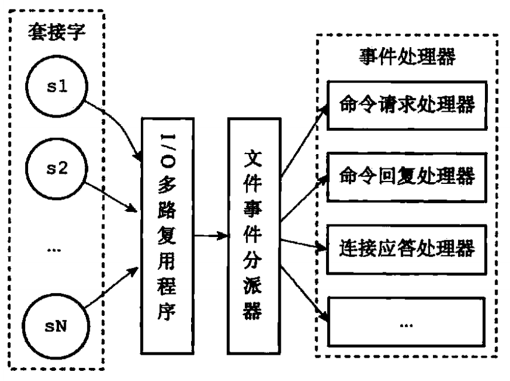

### 数据库

Redis服务器将所有数据库都保存在redisServer结构的db数组中。

#### redisServer数据结构

``` c
struct redisServer {
  // ...
  redisDb *db;
  // 服务器的数据库数量，默认16
  int dbnum;
  // ...
};

struct redisDb {
  // ...
  // 数据库键空间，保存所有键值对
  dict *dict;
  // 过期字典，保存着键的过期时间
  dict *expires;
  // ...
} redisDb;
```

每个Redis客户端都有自己的目标数据库，默认情况下为0号数据库，可以通过`SELECT`命令切换目标数据库。

#### redisClient数据结构

``` c
typedef struct redisClient {
  // ...
  // 目标数据库
  redisDb *db;
}
```

#### 设置键的生存时间或过期时间

Redis中有个设置时间过期的功能，即对存储在 redis 数据库中的键值对可以设置一个过期时间。作为一个缓存数据库，这是非常实用的。如我们一般项目中的 token 或者一些登录信息，尤其是短信验证码都是有时间限制的，按照传统的数据库处理方式，一般都是自己判断过期，这样无疑会严重影响项目性能。

通过`EXPIRE`或者`PEXPIRE`命令，客户端可以设置数据库中某个键的生存时间，服务器会保存这个键的过期时间，到达指定时间后，服务器就会自动删除生存时间为0的键。

`redisDb`中`expires`字段保存了键的过期时间，键为指向过期键的指针，值为过期时间。

#### Redis的键删除策略

redis中采用了惰性删除+定期删除的策略来删除过期键。

- 惰性删除：所有读写Redis数据库的命令执行前都会对输入键进行检查
  - 已过期：删除
  - 未过期：不执行任何操作·
- 定期删除：Redis服务器周期性执行删除操作，在规定时间内，分多次便利各个数据库，从`expires`字典中随机检查一部分键的过期时间，并删除其中的过期键。

##### 持久化和复制期间对过期键的处理

- 生成RDB文件：
  - 已过期的键不会被保存到RDB文件
- 载入RDB文件：
  - master：过期键会被忽略
  - slave: 过期键会被载入，在进行主从同步时，过期键会被删除
- 写入AOF文件：
  - 当某个键已过期，但还未被删除时，AOF文件不会因为它过期而改变
  - 当某个键已过期，并且被删除后，AOF文件会追加一条DEL命令，来显示标记删除。
- 重写AOF文件：
  - 已过期的键不会被保存到AOF文件
- 复制:
  - master在删除一个过期键后会向所有slave发生一个DEL命令，告知slave这个键已过期。
  - slave在执行客户端的读命令时，即使碰到过期键也不会删除，而是当做未过期键处理。
  - slave只有接收到master的DEL命令后才会删除过期键。

但是仅仅通过设置过期时间还是有问题的。我们想一下：如果定期删除漏掉了很多过期 key，然后你也没及时去查，也就没走惰性删除，此时会怎么样？如果大量过期key堆积在内存里，导致redis内存块耗尽了。所以引入了 **redis 内存淘汰机制。**

**redis 提供 6种数据淘汰策略：**

1. **volatile-lru**：从已设置过期时间的数据集（server.db[i].expires）中挑选最近最少使用的数据淘汰
2. **volatile-ttl**：从已设置过期时间的数据集（server.db[i].expires）中挑选将要过期的数据淘汰
3. **volatile-random**：从已设置过期时间的数据集（server.db[i].expires）中任意选择数据淘汰
4. **allkeys-lru**：当内存不足以容纳新写入数据时，在键空间中，移除最近最少使用的key（这个是最常用的）
5. **allkeys-random**：从数据集（server.db[i].dict）中任意选择数据淘汰
6. **no-eviction**：禁止驱逐数据，也就是说当内存不足以容纳新写入数据时，新写入操作会报错。这个应该没人使用吧！

4.0版本后增加以下两种：

1. **volatile-lfu**：从已设置过期时间的数据集(server.db[i].expires)中挑选最不经常使用的数据淘汰
2. **allkeys-lfu**：当内存不足以容纳新写入数据时，在键空间中，移除最不经常使用的key


### RDB持久化

因为Redis时内存数据库，所以提供了持久化功能，其中一种就是RDB持久化。RDB持久化可以将某个时间点上数据库的状态保存到一个RDB文件中。RDB文件是一个经过压缩的二进制文件，可以通过它将数据库还原到生成RDB文件时的状态。

使用`SAVE`命令或`BGSAVE`命令可以生成RDB文件。

- SAVE：会阻塞服务器进程，期间不能处理任何命令。
- BGSAVE：会派生出一个子进程，子进程负责创建RDB文件，父进程继续处理命令请求。

通过配置`save`选项，可以让服务器隔一段时间自动执行`BGSAVE`命令，Redis默认的`save`选项：

```c
// 900秒内对数据库至少修改过1次就会执行BGSAVE
save 900 1
// 300秒内对数据库至少修改过10次就会执行BGSAVE
save 300 10
// 60秒内对数据库至少修改过10000次就会执行BGSAVE
save 60 10000
```

当满足以上任一条件时，就会执行`BGSAVE`命令。


### AOF持久化

与RDB不同的是，AOF持久化是通过保存Redis服务器所执行的命令来记录数据库状态的。所以AOF文件的更新频率通常比RDB更高。AOF文件还原数据的原理也很简单：即将所有命令执行一遍。

- 如果服务器开启了AOF持久化，那么服务器会优先通过AOF文件还原数据库。
- 只有在AOF持久化关闭后，才会使用RDB还原数据库。

#### AOF持久化

可分为`命令追加`、`文件写入`、`文件同步`三个步骤。

- 命令追加：服务器在执行完一个写命令后，会以协议格式将命令追加到`aof_buf`缓冲区末尾。

- 写入与同步：AOF有三种策略来将`aof_buf`缓冲区中的内容写入AOF文件里面，可以通过修改`appendfsync`选项来配置策略。

  - `always`：服务器在每个时间循环都要将`aof_buf`缓冲区中的写入并同步到AOF文件。
  - `everysec`：服务器在每个时间循环都要将`aof_buf`缓冲区中的写入到AOF文件，并且每隔一秒就要在子线程中对AOF文件进行一次同步。
  - `no`:服务器在每个时间循环都要将`aof_buf`缓冲区中的写入到AOF文件，由操作系统负责同步。

  一般采用`everysec`策略，即一秒钟同步一次，这样效率足够高，并且最多只会丢失一秒的数据。

#### AOF重写

随着服务器运行时间的流逝，AOF文件中的内容会越来越多，所以需要进行重写来解决文件体积膨胀的问题。AOF文件重写并不需要对现有AOF文件进行任何操作，而是通过读取当前服务器状态来实现。所以重写后的AOF文件只包含还原当前数据库所必需的命令，不会浪费任何硬盘空间。

AOF重写是在子进程中进行的，这样有两个好处：

- 子进程重写AOF期间，父进程可以继续处理命令请求。
- 子进程带有父进程的数据副本，因为子进程不是线程，所以可以在避免使用锁的情况下保证数据安全性。

在执行重写过程中，数据库仍然会执行命令，这样可能会造成重写后的AOF文件与当前数据库状态不一致的问题，所以Redis服务器设置了一个AOF重写缓冲区，在重写过程中，Redis执行完一条写命令后，会将这条命令写入AOF缓冲区和AOF重写缓冲区。当AOF重写完成后，子进程会向父进程发送一个信号，父进程接收到信号后，会调用一个信号处理函数，将AOF重写缓冲区中的内容写入到新的AOF文件中，然后原子的覆盖旧的AOF文件。在整个AOF重写过程中，只有执行信号处理函数的时候父进程会被阻塞。


### 事件

Redis服务器是一个事件驱动程序，需要处理两类事件：

- 文件事件：Redis服务器通过套接字与客户端连接，文件事件就是服务器对套接字操作的抽象。
- 时间事件：Redis服务器的一些操作需要在给定时间点执行，时间事件就是服务器对这类操作的抽象。

#### 文件事件

Redis基于Reactor模式开发了一套网络事件处理模型，即文件事件处理器。其使用IO多路复用程序同事监听多个套接字，当套接字准备好执行应答、写入、读取、关闭等操作时，会产生一个文件事件，IO多路复用程序将文件事件按顺序放入一个队列中，以有序、同步、每次一个套接字的方式向文件事件分派器传送套接字，当处理完毕后才会继续处理队列中下一个套接字。



文件事件处理器以单线程模式运行，通过IO多路复用程序监听多个套接字，实现了高性能的网络通信模型，又可以很好地与其他同样以单线程模式运行的模块对接。


#### 时间事件

Redis的时间事件分为两类：

- 定时事件：让一段程序在指定时间之后执行一次。
- 周期事件：让一段程序每隔一段时间执行一次。

所有时间事件都放在一个无序链表中，每当时间事件执行器运行时，就遍历整个链表，查找所有已到达的时间事件，并调用相应的事件处理器。所以时间事件的实际处理事件通常会比设定的到达时间晚一点。

文件事件和时间事件是合作关系，服务器会轮流处理这两种事件，并且处理事件过程中不会进行抢占。

