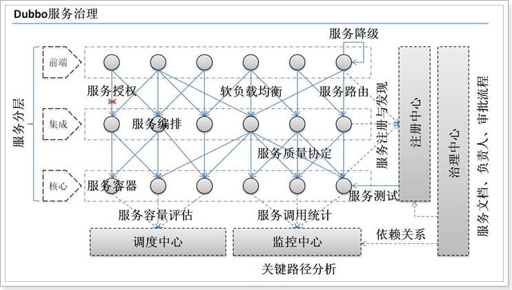

### 系统架构演变

随着互联网的发展，网站应用的规模不断扩大。需求的激增，带来的是技术上的压力。系统架构也因此也不断的演进、升级、迭代。从单一应用，到垂直拆分，分布式服务，SOA，再到现在火热的微服务架构。

#### 集中式架构

当系统流量很小时，只需一个应用，将所有功能都部署在一起，以减少部署节点和成本。

 

存在的问题：

- 代码耦合，开发维护困难
- 无法针对不同模块进行针对性优化
- 无法水平扩展
- 单点容错率低，并发能力差

#### 垂直拆分

当访问量逐渐增大，单一应用无法满足需求，为了应对高并发和业务需求，需要根据业务功能对系统进行拆分：

 

优点：

- 系统拆分实现了流量分担，解决了并发问题
- 可以针对不同模块进行优化
- 方便水平扩展，负载均衡，容错率提高

缺点：

- 系统间相互独立，会有很多重复开发工作，影响开发效率

#### 分布式服务

当垂直应用越来越多，应用之间交互不可避免，将核心业务抽取出来，作为独立的服务，逐渐形成稳定的服务中心，使前端应用能更快速的响应多变的市场需求。此时，用于提高业务复用及整合的分布式调用是关键。

 

优点：

- 将基础服务进行了抽取，系统间相互调用，提高了代码复用和开发效率

缺点：

- 系统间耦合度变高，调用关系错综复杂，难以维护

#### 服务治理（SOA）

当服务越来越多，容量的评估，小服务资源的浪费等问题逐渐显现，此时需增加一个调度中心基于访问压力实时管理集群容量，提高集群利用率。此时，用于提高机器利用率的资源调度和治理中心(SOA)是关键

以前出现的问题

- 服务越来越多，需要管理每个服务的地址
- 调用关系错综复杂，难以理清依赖关系
- 服务过多，服务状态难以管理，无法根据服务情况动态管理

服务治理的任务

- 服务注册中心，实现服务自动注册和发现，无需人为记录服务地址
- 服务自动订阅，服务列表自动推送，服务调用透明化，无需关心依赖关系
- 动态监控服务状态监控报告，人为控制服务状态

缺点：

- 服务间会有依赖关系，一旦某个环节出错会影响较大
- 服务关系复杂，运维、测试部署困难，不符合DevOps思想

## 1.5.微服务

前面说的SOA，英文翻译过来是面向服务。微服务，似乎也是服务，都是对系统进行拆分。因此两者非常容易混淆，但其实缺有一些差别：

微服务的特点：

- 单一职责：微服务中每一个服务都对应唯一的业务能力，做到单一职责
- 微：微服务的服务拆分粒度很小。
- 面向服务：面向服务是说每个服务都要对外暴露服务接口API。并不关心服务的技术实现，做到与平台和语言无关，也不限定用什么技术实现，只要提供Rest的接口即可。
- 自治：自治是说服务间互相独立，互不干扰
  - 团队独立：每个服务都是一个独立的开发团队，人数不能过多。
  - 技术独立：因为是面向服务，提供Rest接口，使用什么技术没有别人干涉
  - 前后端分离：采用前后端分离开发，提供统一Rest接口，后端不用再为PC、移动段开发不同接口
  - 数据库分离：每个服务都使用自己的数据源
  - 部署独立，服务间虽然有调用，但要做到服务重启不影响其它服务。有利于持续集成和持续交付。每个服务都是独立的组件，可复用，可替换，降低耦合，易维护

微服务结构图：

### 谈谈对微服务的理解

1. 微服务很小，以业务边界确定系统边界，每个服务专注于做好一件事情。
2. 微服务具有自治性，服务之间通过暴露API实现网络通信，服务高度内聚可单独部署，互不影响。

### 微服务的好处

1. 技术的异构性：根据服务需求选择合适的技术实现。
2. 提升效率：小型代码在小型团队更为高效，接口约束后，可以并行开发。
3. 弹性：微服务中如果一个服务不可用了，不会导致整个应用都不可用。
4. 易扩容：可以只对需要扩容的服务进行扩容，降低成本。
5. 可组合性：可以根据不同的目的，通过不同的方式使用同一个功能。
6. 简化部署：各服务的部署时独立的，当部分代码发生变更后，只需要重新部署对应的服务。
7. 降低风险：重写或者移除小规模服务阻碍很小。

### 微服务架构的不足

- 运维要求较高
  - 对于单体架构来讲，只需要维护好这一个项目就可以了。但是对于微服务架构来讲，由于项目是由多个微服务构成的，每个模块出现问题都会造成整个项目运行出现异常，这就对运维人员提出了很高的要求。
- 分布式的复杂性
  - 对于微服务架构来说，分布式是必需的技术，由于分布式的复杂性，导致微服务架构也变得复杂起来。

- 接口调整成本高
  - 微服务的接口发生大的变动时，所有依赖它的微服务可能都要做相应的调整，由于微服务可能非常多，那么调整接口所造成的成本将会明显提高。

- 重复劳动
  - 对于单体架构来讲，如果某段业务被多个模块所共同使用，我们可以抽象成一个工具类，被所有模块直接调用。但是微服务的工具类是不能被其它微服务所直接调用的，从而我们便不得不在每个微服务上都建这么一个工具类，从而导致代码的重复。

### HTTP调用和RPC调用的比较

在HTTP和RPC的选择上，有些人是迷惑的。有些RPC框架配置复杂，用HTTP也能完成同样的功能，为什么要选择RPC，而不是更容易上手的HTTP来实现了。

**比较一下：**

- 传输协议 
  - RPC：可以基于TCP协议，也可以基于HTTP协议。
  - HTTP：基于HTTP协议。

- 传输效率
  - RPC：使用自定义的TCP协议，可以让请求报文体积更小，或者使用HTTP2协议，也可以很好的减少报文的体积，提高传输效率。
  - HTTP：如果是基于HTTP1.1的协议，请求中会包含很多无用的内容，如果是基于HTTP2.0，那么简单的封装以下是可以作为一个RPC来使用的，这时标准RPC框架更多的是服务治理。
- 性能消耗（主要在于序列化和反序列化的耗时）
  - RPC：可以基于thrift实现高效的二进制传输
  - HTTP：大部分是通过json来实现的，字节大小和序列化耗时都比thrift要更消耗性能
- 灵活性
  - HTTP：不关心实现细节，跨平台、跨语言
  - RPC：部分不支持跨平台、跨预言

RPC主要用于公司内部的服务调用，性能消耗低，传输效率高，服务治理方便。

HTTP主要用于对外的异构环境，浏览器接口调用，APP接口调用，第三方接口调用等。

### 微服务部署策略

微服务应用程序由数十甚至上百个服务组成。服务以不同的语言和框架编写。每个都是一个迷你的应用程序，具有自己特定的部署、资源、扩展和监视要求。需要根据该服务的需求运行每个服务的一定数量的实例。此外，必须为每个服务实例提供相应的 CPU、内存和 I/O 资源。

### 参考资料

- 《微服务设计》

