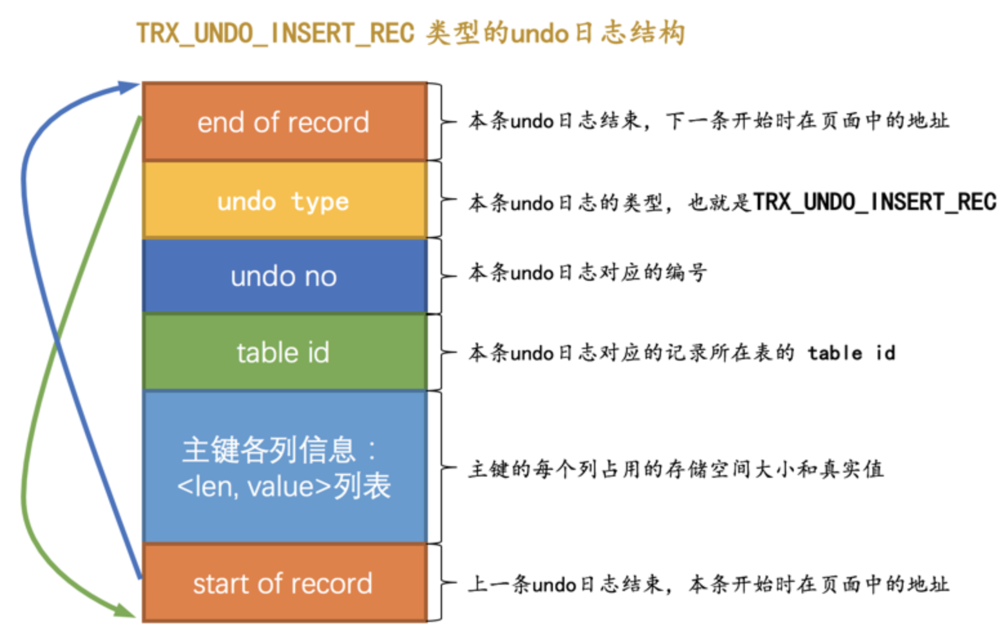
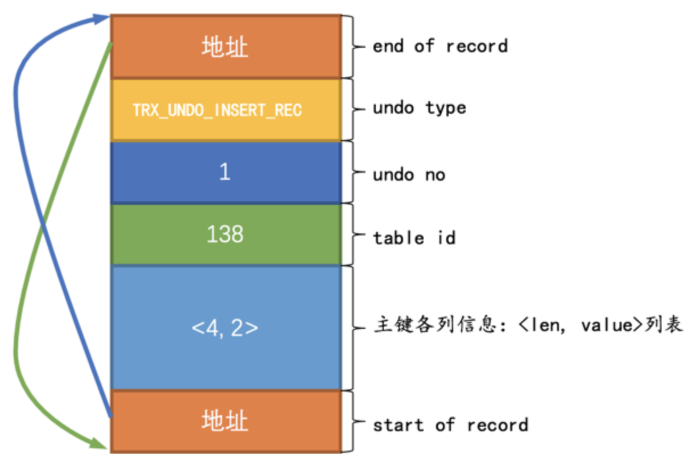
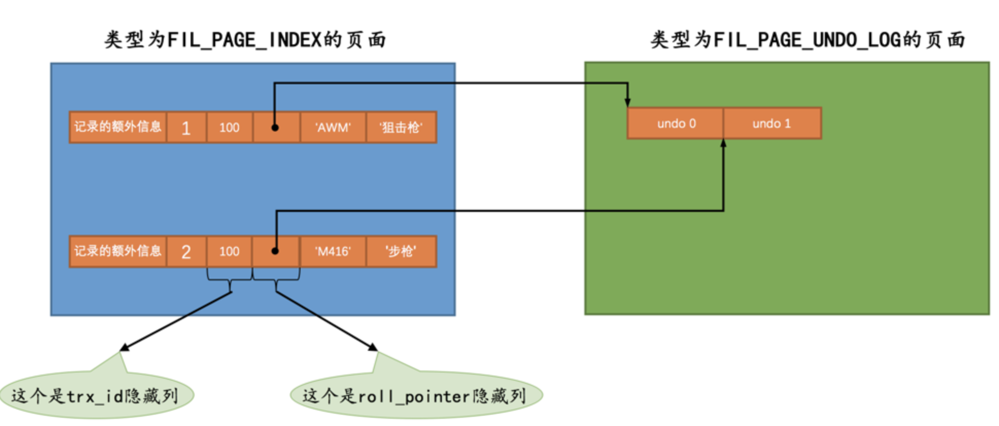
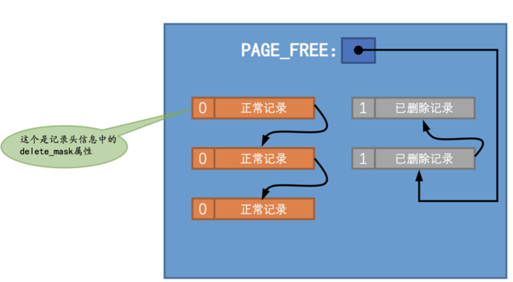
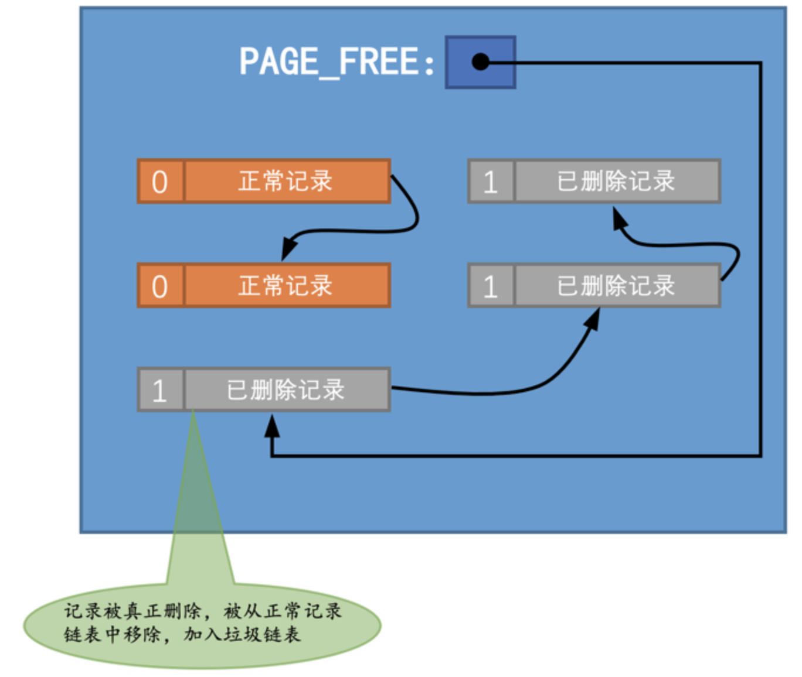
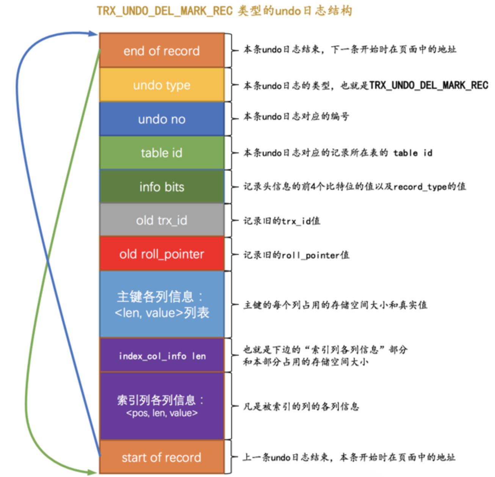
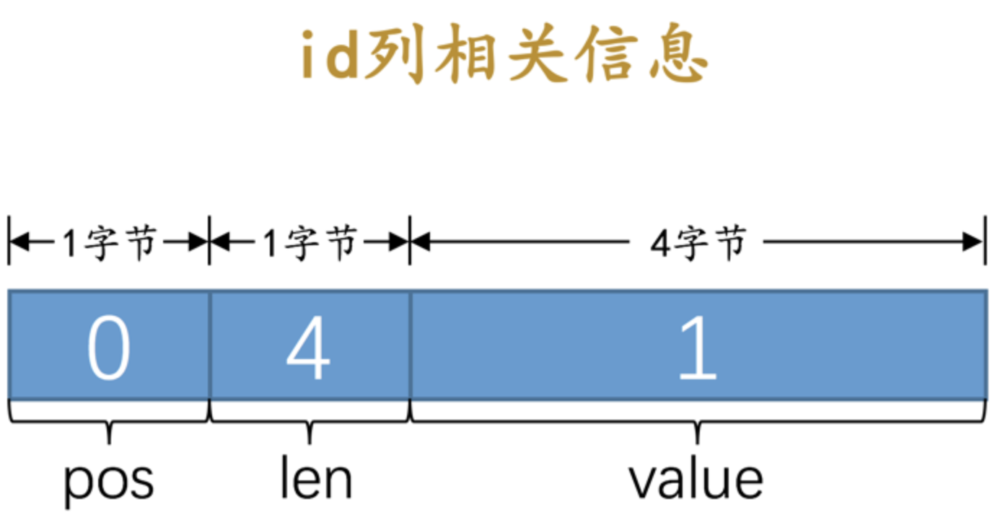
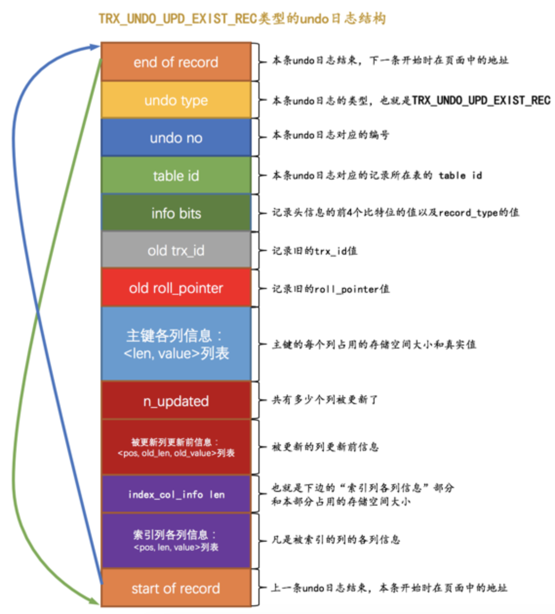
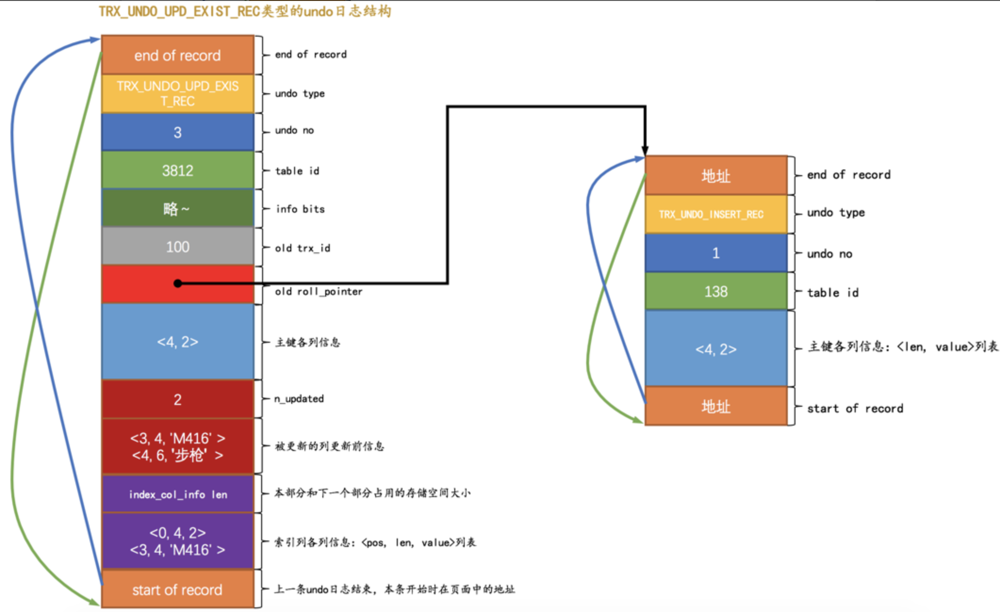
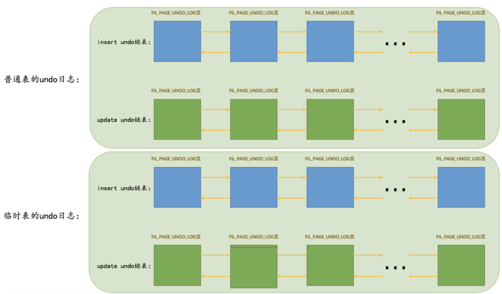

## 事务回滚的需求

设计数据库的大叔把这些为了回滚而记录的这些东东称之为撤销日志，英文名为`undo log`。由于查询操作并不会修改任何用户记录，所以在查询操作执行时，并不需要记录相应的`undo日志`。在真实的`InnoDB`中，`undo日志`其实并不像我们上边所说的那么简单，不同类型的操作产生的`undo日志`的格式也是不同的。

## 事务id

### 给事务分配id的时机

如果某个事务执行过程中对某个表执行了增、删、改操作，那么`InnoDB`存储引擎就会给它分配一个独一无二的`事务id`，分配方式如下：

- 对于只读事务来说，只有在它第一次对某个用户创建的临时表执行增、删、改操作时才会为这个事务分配一个`事务id`，否则的话是不分配`事务id`的。
- 对于读写事务来说，只有在它第一次对某个表（包括用户创建的临时表）执行增、删、改操作时才会为这个事务分配一个`事务id`，否则的话也是不分配`事务id`的。

### 事务id是怎么生成的

它的分配策略和我们前边提到的对隐藏列`row_id`的分配策略大抵相同，具体策略如下：

- 服务器会在内存中维护一个全局变量，每当需要为某个事务分配一个`事务id`时，就会把该变量的值当作`事务id`分配给该事务，并且把该变量自增1。
- 每当这个变量的值为`256`的倍数时，就会将该变量的值刷新到系统表空间的页号为`5`的页面中一个称之为`Max Trx ID`的属性处，这个属性占用`8`个字节的存储空间。
- 当系统下一次重新启动时，会将上边提到的`Max Trx ID`属性加载到内存中，将该值加上256之后赋值给我们前边提到的全局变量（因为在上次关机时该全局变量的值可能大于`Max Trx ID`属性值）。

这样就可以保证整个系统中分配的`事务id`值是一个递增的数字。

### trx_id隐藏列

聚簇索引的记录除了会保存完整的用户数据以外，而且还会自动添加名为trx_id、roll_pointer的隐藏列，如果用户没有在表中定义主键以及UNIQUE键，还会自动添加一个名为row_id的隐藏列：


其中的`trx_id`列其实还蛮好理解的，就是某个对这个聚簇索引记录做改动的语句所在的事务对应的`事务id`而已

## undo日志的格式

为了实现事务的`原子性`，`InnoDB`存储引擎在实际进行增、删、改一条记录时，都需要先把对应的`undo日志`记下来。一个事务在执行过程中可能新增、删除、更新若干条记录，也就是说需要记录很多条对应的`undo日志`，这些`undo日志`会被从`0`开始编号，这个编号也被称之为`undo no`。

这些`undo日志`是被记录到类型为`FIL_PAGE_UNDO_LOG`的页面中。这些页面可以从系统表空间中分配，也可以从一种专门存放`undo日志`的表空间，也就是所谓的`undo tablespace`中分配。创建一个名为`undo_demo`的表：

```mysql
CREATE TABLE undo_demo (
    id INT NOT NULL,
    key1 VARCHAR(100),
    col VARCHAR(100),
    PRIMARY KEY (id),
    KEY idx_key1 (key1)
)Engine=InnoDB CHARSET=utf8;
```

这个表中有3个列，其中`id`列是主键，我们为`key1`列建立了一个二级索引，`col`列是一个普通的列。我们前边介绍`InnoDB`的数据字典时说过，每个表都会被分配一个唯一的`table id`，我们可以通过系统数据库`information_schema`中的`innodb_sys_tables`表来查看某个表对应的`table id`是什么。从查询结果可以看出，`undo_demo`表对应的`table id`为`138`。

### INSERT操作对应的undo日志

如果希望回滚一条插入操作，那么把这条记录删除就好了，也就是说在写对应的`undo`日志时，主要是把这条记录的主键信息记上。所以设计`InnoDB`的大叔设计了一个类型为`TRX_UNDO_INSERT_REC`的`undo日志`：



- `undo no`在一个事务中是从`0`开始递增的，也就是说只要事务没提交，每生成一条`undo日志`，那么该条日志的`undo no`就增1。
- 如果记录中的主键只包含一个列，那么在类型为`TRX_UNDO_INSERT_REC`的`undo日志`中只需要把该列占用的存储空间大小和真实值记录下来，如果记录中的主键包含多个列，那么每个列占用的存储空间大小和对应的真实值都需要记录下来。

现在我们向`undo_demo`中插入两条记录：

```mysql
BEGIN;  # 显式开启一个事务，假设该事务的id为100

# 插入两条记录
INSERT INTO undo_demo(id, key1, col) 
    VALUES (1, 'AWM', '狙击枪'), (2, 'M416', '步枪');
```

因为记录的主键只包含一个`id`列，所以我们在对应的`undo日志`中只需要将待插入记录的`id`列占用的存储空间长度和真实值记录下来。本例中插入了两条记录，所以会产生两条类型为`TRX_UNDO_INSERT_REC`的`undo日志`:

- 第一条`undo日志`的`undo no`为`0`，记录主键占用的存储空间长度为`4`，真实值为`1`：

  

- 第二条`undo日志`的`undo no`为`1`，记录主键占用的存储空间长度为`4`，真实值为`2`：

  

#### roll_pointer隐藏列的含义

本质上就是一个指向记录对应的`undo日志`的一个指针。比方说我们上边向`undo_demo`表里插入了2条记录，每条记录都有与其对应的一条`undo日志`。记录被存储到了类型为`FIL_PAGE_INDEX`的页面中，`undo日志`被存放到了类型为`FIL_PAGE_UNDO_LOG`的页面中。效果如图所示：



### DELETE操作对应的undo日志

插入到页面中的记录会根据记录头信息中的`next_record`属性组成一个单向链表，我们把这个链表称之为`正常记录链表`；被删除的记录其实也会根据记录头信息中的`next_record`属性组成一个链表，只不过这个链表中的记录占用的存储空间可以被重新利用，所以也称这个链表为`垃圾链表`。`Page Header`部分有一个称之为`PAGE_FREE`的属性，它指向由被删除记录组成的垃圾链表中的头节点。假设此刻某个页面中的记录分布情况是这样的：



现在我们准备使用`DELETE`语句把`正常记录链表`中的最后一条记录给删除掉，这个删除的过程需要经历两个阶段：

- 阶段一：仅仅将记录的`delete_mask`标识位设置为`1`，其他的不做修改（其实会修改记录的`trx_id`、`roll_pointer`这些隐藏列的值）。设计`InnoDB`的大叔把这个阶段称之为`delete mark`：

  

  可以看到，`正常记录链表`中的最后一条记录的`delete_mask`值被设置为`1`，但是并没有被加入到`垃圾链表`。也就是此时记录处于一个`中间状态`。在删除语句所在的事务提交之前，被删除的记录一直都处于这种所谓的`中间状态`。

- 阶段二：当该删除语句所在的事务提交之后，会有专门的线程来把该记录从`正常记录链表`中移除，并且加入到`垃圾链表`中，然后还要调整一些页面的其他信息。这个阶段称为`purge`。执行完后这条记录就算是真正的被删除掉了。这条已删除记录占用的存储空间也可以被重新利用了：

  

  对照着图我们还要注意一点，将被删除记录加入到`垃圾链表`时，实际上加入到链表的头节点处，会跟着修改`PAGE_FREE`属性的值。

在删除语句所在的事务提交之前，只会经历`delete mark`阶段。设计`InnoDB`的大叔为此设计了一种称之为`TRX_UNDO_DEL_MARK_REC`类型的`undo日志`：



注意一下这几点：

- 在对一条记录进行`delete mark`操作前，需要把该记录的旧的`trx_id`和`roll_pointer`隐藏列的值都给记到对应的`undo日志`中来，就是`old trx_id`和`old roll_pointer`属性。这样有一个好处，那就是可以通过`undo日志`的`old roll_pointer`找到记录在修改之前对应的`undo`日志。比方说在一个事务中，我们先插入了一条记录，然后又执行对该记录的删除操作：

  

  从图中可以看出来，执行完`delete mark`操作后，它对应的`undo`日志和`INSERT`操作对应的`undo`日志就串成了一个链表。这个很有意思啊，这个链表就称之为`版本链`。

- 与类型为`TRX_UNDO_INSERT_REC`的`undo日志`不同，类型为`TRX_UNDO_DEL_MARK_REC`的`undo`日志还多了一个`索引列各列信息`的内容，也就是说如果某个列被包含在某个索引中，那么它的相关信息就应该被记录到这个`索引列各列信息`部分，所谓的相关信息包括该列在记录中的位置，该列占用的存储空间大小，该列实际值。所以`索引列各列信息`存储的内容实质上就是`<pos, len, value>`的一个列表。这部分信息主要是用在事务提交后，对该`中间状态记录`做真正删除的阶段二，也就是`purge`阶段中使用。

那个事务id为`100`的事务中删除一条记录，比如我们把`id`为1的那条记录删除掉：

```mysql
BEGIN;  # 显式开启一个事务，假设该事务的id为100

# 插入两条记录
INSERT INTO undo_demo(id, key1, col) 
    VALUES (1, 'AWM', '狙击枪'), (2, 'M416', '步枪');
    
# 删除一条记录    
DELETE FROM undo_demo WHERE id = 1; 
```

这个`delete mark`操作对应的`undo日志`的结构就是这样：


对照着这个图，我们得注意下边几点：

- 因为这条`undo`日志是`id`为`100`的事务中产生的第3条`undo`日志，所以它对应的`undo no`就是`2`。

- 在对记录做`delete mark`操作时，记录的`trx_id`隐藏列的值是`100`（也就是说对该记录最近的一次修改就发生在本事务中），所以把`100`填入`old trx_id`属性中。然后把记录的`roll_pointer`隐藏列的值取出来，填入`old roll_pointer`属性中，这样就可以通过`old roll_pointer`属性值找到最近一次对该记录做改动时产生的`undo日志`。

- 由于`undo_demo`表中有2个索引：一个是聚簇索引，一个是二级索引`idx_key1`。只要是包含在索引中的列，那么这个列在记录中的位置，占用存储空间大小和实际值，就需要存储到`undo日志`中。

  - 对于主键来说，只包含一个`id`列，存储到`undo日志`中的相关信息分别是：

    - `pos`：`id`列是主键，也就是在记录的第一个列，它对应的`pos`值为`0`。`pos`占用1个字节来存储。
    - `len`：`id`列的类型为`INT`，占用4个字节，所以`len`的值为`4`。`len`占用1个字节来存储。
    - `value`：在被删除的记录中`id`列的值为`1`，也就是`value`的值为`1`。`value`占用4个字节来存储。

    画一个图演示一下就是这样：

    

    所以对于`id`列来说，最终存储的结果就是`<0, 4, 1>`，存储这些信息占用的存储空间大小`6`个字节。

  - 对于`idx_key1`来说，只包含一个`key1`列，存储到`undo日志`中的相关信息分别是：

    - `pos`：`key1`列排在`id`列、`trx_id`列、`roll_pointer`列之后，它的`pos`值为`3`，用1个字节存储。
    - `len`：`key1`列的类型为`VARCHAR(100)`，使用`utf8`字符集，被删除的记录实际存储的内容是`AWM`，所以一共占用3个字节，也就是所以`len`的值为`3`。`len`占用1个字节来存储。
    - `value`：被删除的记录中`key1`列值为`AWM`，也就是`value`的值为`AWM`。`value`占用3个字节来存储。

    画一个图演示一下就是这样：

    

    所以对于`key1`列来说，最终存储的结果就是`<3, 3, 'AWM'>`，占用的存储空间大小为`5`个字节。

  从上边的叙述中可以看到，`<0, 4, 1>`和`<3, 3, 'AWM'>`共占用`11`个字节。然后`index_col_info len`本身占用`2`个字节，所以加起来一共占用`13`个字节，把数字`13`就填到了`index_col_info len`的属性中。

### UPDATE操作对应的undo日志

在执行`UPDATE`语句时，`InnoDB`对更新主键和不更新主键这两种情况有截然不同的处理方案。

#### 不更新主键的情况

在不更新主键的情况下，又可以细分为被更新的列占用的存储空间不发生变化和发生变化的情况。

- 就地更新

  更新记录时，对于被更新的每个列来说，如果更新后的列和更新前的列占用的存储空间都一样大，那么就可以进行`就地更新`，也就是直接在原记录的基础上修改对应列的值。

- 先删除掉旧记录，再插入新记录

  在不更新主键的情况下，如果有任何一个被更新的列更新前和更新后占用的存储空间大小不一致，那么就需要先把这条旧的记录从聚簇索引页面中删除掉，然后再根据更新后列的值创建一条新的记录插入到页面中。这里所说的`删除`并不是`delete mark`操作，而是真正的删除掉，也就是把这条记录从`正常记录链表`中移除并加入到`垃圾链表`中，并且修改页面中相应的统计信息。不过这里做真正删除操作的线程并不是在唠叨`DELETE`语句中做`purge`操作时使用的另外专门的线程，而是由用户线程同步执行真正的删除操作，真正删除之后紧接着就要根据各个列更新后的值创建的新记录插入。如果新创建的记录占用的存储空间大小不超过旧记录占用的空间，那么可以直接重用被加入到`垃圾链表`中的旧记录所占用的存储空间，否则的话需要在页面中新申请一段空间以供新记录使用，如果本页面内已经没有可用的空间的话，那就需要进行页面分裂操作，然后再插入新记录。

针对`UPDATE`不更新主键的情况，设计了一种类型为`TRX_UNDO_UPD_EXIST_REC`的`undo日志`：



要注意这么几点：

- `n_updated`属性表示本条`UPDATE`语句执行后将有几个列被更新，后边跟着的`<pos, old_len, old_value>`分别表示被更新列在记录中的位置、更新前该列占用的存储空间大小、更新前该列的真实值。
- 如果在`UPDATE`语句中更新的列包含索引列，那么也会添加`索引列各列信息`这个部分。

现在继续在上边那个事务id为100的事务中更新一条记录，比如我们把id为2的那条记录更新一下：

```mysql
BEGIN;  # 显式开启一个事务，假设该事务的id为100

# 插入两条记录
INSERT INTO undo_demo(id, key1, col) 
    VALUES (1, 'AWM', '狙击枪'), (2, 'M416', '步枪');
    
# 删除一条记录    
DELETE FROM undo_demo WHERE id = 1; 

# 更新一条记录
UPDATE undo_demo
    SET key1 = 'M249', col = '机枪'
    WHERE id = 2;
```

这个`UPDATE`语句更新的列大小都没有改动，所以可以采用`就地更新`的方式来执行，在真正改动页面记录时，会先记录一条类型为`TRX_UNDO_UPD_EXIST_REC`的`undo日志`，长这样：



对照着这个图我们注意一下这几个地方：

- 因为这条`undo日志`是`id`为`100`的事务中产生的第4条`undo日志`，所以它对应的`undo no`就是3。
- 这条日志的`roll_pointer`指向`undo no`为`1`的那条日志，也就是插入主键值为`2`的记录时产生的那条`undo日志`，也就是最近一次对该记录做改动时产生的`undo日志`。
- 由于本条`UPDATE`语句中更新了索引列`key1`的值，所以需要记录一下`索引列各列信息`部分，也就是把主键和`key1`列更新前的信息填入。

## Undo页面链表

### 单个事务中的Undo页面链表

因为一个事务可能包含多个语句，而且一个语句可能对若干条记录进行改动，而对每条记录进行改动前，都需要记录1条或2条的`undo日志`，所以在一个事务执行过程中可能产生很多`undo日志`，这些日志可能一个页面放不下，需要放到多个页面中，这些页面就通过我们`TRX_UNDO_PAGE_NODE`属性连成了链表。我们特意把链表中的第一个`Undo页面`给标了出来，称它为`first undo page`，其余的`Undo页面`称之为`normal undo page`，这是因为在`first undo page`中除了记录`Undo Page Header`之外，还会记录其他的一些管理信息。

在一个事务执行过程中，可能混着执行`INSERT`、`DELETE`、`UPDATE`语句，也就意味着会产生不同类型的`undo日志`。所以在一个事务执行过程中就可能需要2个`Undo页面`的链表，一个称之为`insert undo链表`，另一个称之为`update undo链表`。另外，规定对普通表和临时表的记录改动时产生的`undo日志`要分别记录，所以在一个事务中最多有4个以`Undo页面`为节点组成的链表：



分配策略如下：

- 刚刚开启事务时，一个`Undo页面`链表也不分配。
- 当事务执行过程中向普通表中插入记录或者执行更新记录主键的操作之后，就会分配一个`普通表的insert undo链表`。
- 当事务执行过程中删除或者更新了普通表中的记录之后，就会为其分配一个`普通表的update undo链表`。
- 当事务执行过程中向临时表中插入记录或者执行更新记录主键的操作之后，就会为其分配一个`临时表的insert undo链表`。
- 当事务执行过程中删除或者更新了临时表中的记录之后，就会为其分配一个`临时表的update undo链表`。

### 多个事务中的Undo页面链表

不同事务执行过程中产生的undo日志需要被写入到不同的Undo页面链表中。如果有更多的事务，那就意味着可能会产生更多的`Undo页面`链表。